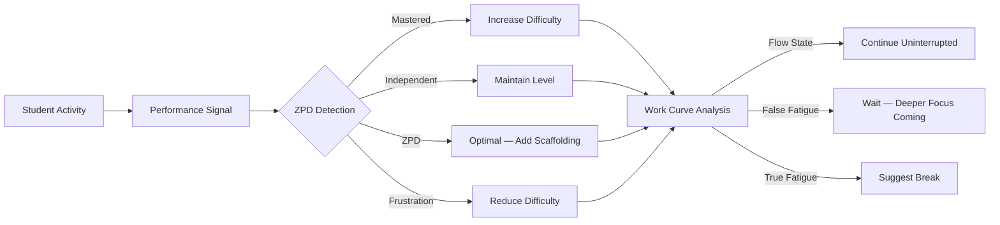
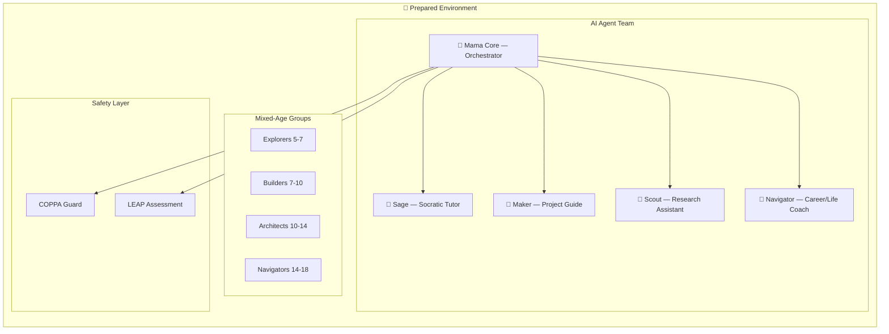
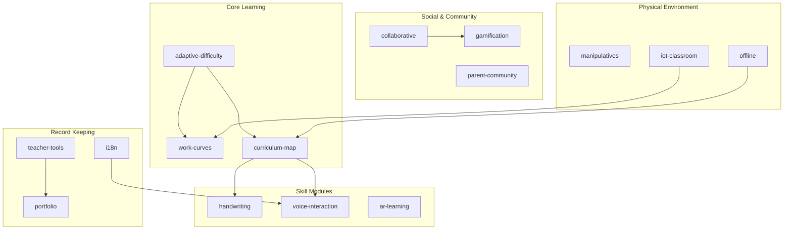

<p align="center">
  <h1 align="center">MAMA Montessori</h1>
  <h3 align="center"><em>A-class education for every child on earth. Open-source. Free forever.<br>Because privatizing education is the problem, not the solution.</em></h3>
</p>

<p align="center">
  <a href="LICENSE"></a>
  
  
  
  
  <a href="https://mama.oliwoods.ai"></a>
  <a href="https://mama.oliwoods.ai/foundation"></a>
</p>

---

> **A Montessori education costs $15,000–$30,000/year — and even at that price, most schools can't implement the full methodology.** The pedagogy is proven: students outperform traditional education on every metric — academic achievement, social development, creativity, executive function, love of learning. But access is gated behind tuition that 99% of the world's families will never afford, and the schools that do exist cherry-pick the parts that are easy to staff. **This library goes deeper than most Montessori schools do.** It encodes the complete methodology — sensitive periods, three-period lessons, normalization tracking, mixed-age mentorship — as composable algorithms that run offline on a $170 Raspberry Pi. Manhattan prep school or rural village: same AI teacher. **We're open-sourcing the pedagogy. Let the private schools try to compete with free.**

---

## Why This Exists

- **90% of children in low-income countries cannot read by age 10** (World Bank, 2022). The global education system is not underperforming — it is failing.
- **Montessori methodology is proven but locked behind $30K/year tuition.** The science is public. The implementation has been privatized. We're reversing that.
- **We turned the pedagogy into algorithms any developer can use.** Pure TypeScript functions with Zod schemas. No server required, no vendor lock-in, no black box.
- **Runs offline on a $170 Raspberry Pi** — no internet, no cloud, no subscription. Pairs with [mama-ai-clinic](https://github.com/OliWoods-Org/mama-ai-clinic) for the hardware layer.
- **A school in rural Kenya gets the same AI teacher as one in Manhattan.** That's the point.

---

## What This Is

A **TypeScript algorithm library** implementing core Montessori education principles as composable, pure functions with Zod schemas. It provides the building blocks -- adaptive difficulty engines, curriculum mapping, handwriting analysis, work cycle analytics -- that any education app can integrate.

This is **not** a full application. There's no server, no database, no UI. It's a library of algorithms and data models designed to be imported into your own education platform.

```
npm install mama-montessori
```

```typescript
import {
  processPerformanceSignal,   // Adaptive difficulty with ZPD tracking
  analyzeWorkCurves,           // Montessori work cycle analytics
  analyzeTracing,              // Handwriting stroke analysis
  findMentorshipMatches,       // Mixed-age peer mentoring
  getLearningPath,             // Prerequisite-based curriculum paths
} from "mama-montessori";
```

## How It Works

### Student Learning Flow



### Montessori Classroom Model



### Module Architecture



## The 15 Modules

| # | Module | What it does |
|---|--------|-------------|
| 1 | **adaptive-difficulty** | Zone of Proximal Development tracking, mastery-based progression, frustration detection |
| 2 | **work-curves** | Concentration pattern analysis, flow state detection, false fatigue recognition |
| 3 | **curriculum-map** | 5-domain curriculum with prerequisite graphs, learning paths, progress tracking |
| 4 | **handwriting** | Stroke analysis, pressure/smoothness metrics, Montessori phonetic letter order |
| 5 | **voice-interaction** | Voice commands, pronunciation assessment (Levenshtein-based), age-appropriate configs |
| 6 | **collaborative** | Mixed-age mentorship matching (age-gap rules), group projects, social skill profiles |
| 7 | **gamification** | Non-competitive badges, streak system with grace days, personal challenges |
| 8 | **manipulatives** | Physical material tracking (NFC/QR/camera), usage patterns, mastery estimation |
| 9 | **ar-learning** | AR scene types, virtual manipulatives, spatial reasoning assessment |
| 10 | **i18n** | 25 language configs, RTL support, fallback chains, Montessori glossary |
| 11 | **iot-classroom** | Environmental monitoring (CO2, noise, light), optimal ranges, layout recommendations |
| 12 | **portfolio** | Student work curation, growth snapshots, school transition portfolios |
| 13 | **teacher-tools** | Three-period lesson planning, observation templates, progress report generation |
| 14 | **parent-community** | Community forums, local group finder (haversine), event management |
| 15 | **offline** | Content pack management, storage estimation, offline readiness validation |

## Built for Everywhere

- **Offline-first architecture** — the `offline` module handles content pack management, storage estimation, and readiness validation. No internet required after initial setup.
- **25 languages with RTL support** — Arabic, Hebrew, Urdu, and 22 more. Fallback chains ensure every child sees their language first.
- **Pairs with [mama-ai-clinic](https://github.com/OliWoods-Org/mama-ai-clinic)** — a $170 Raspberry Pi that runs the full AI stack offline. The hardware project that makes this library physical.
- **No internet required** — once content packs are synced, the entire system runs air-gapped. Pack download URLs are configurable — point them to your own CDN or local mirror.
- **No subscription, no paywall, no data collection** — GPL-3.0 forever. Student data never leaves the device.

## The Montessori Method — Why It Works

This library encodes six core Montessori principles as algorithms, not just vocabulary:

- **Self-directed learning** — Children choose their own work. The algorithm tracks choices, not assignments. The adaptive-difficulty engine responds to what the child selects, never prescribes.
- **Sensitive periods** — Windows of intense developmental interest (language 0-6, order 1-3, math 4-6). The curriculum engine respects these windows and surfaces age-appropriate material automatically.
- **Three-period lesson** — Naming, Recognition, Recall. The teacher-tools module generates these sequences automatically for any curriculum node.
- **Normalization** — The process of developing sustained concentration through freely chosen, meaningful work. Work curves track this famous Montessori concentration arc, including false fatigue detection.
- **Mixed-age grouping** — Older children teach younger ones; both grow. The collaborative module enforces age-gap rules and tracks mutual growth across mentor-mentee pairs.
- **Prepared environment** — The classroom itself teaches. IoT sensors monitor CO2, noise, light, and temperature for optimal learning conditions. The environment adapts to the children, not the other way around.
- **Control of error** — Materials designed so the child can self-correct without external grading. The adaptive engine provides feedback through the material, not through judgment.

### Research Backing

> Lillard, A. S. (2012). "Preschool children's development in classic Montessori, supplemented Montessori, and conventional programs." *Journal of School Psychology.* — Montessori students showed significantly higher academic achievement, social cognition, and executive function.

> Lillard, A. S. & Else-Quest, N. (2006). "Evaluating Montessori Education." *Science, 313*(5795). — The landmark Milwaukee study showing Montessori 5-year-olds outperformed controls on reading, math, and social problem-solving.

> Marshall, C. (2017). "Montessori education: a review of the evidence base." *npj Science of Learning.* — Meta-review confirming positive effects across academic and non-academic outcomes.

---

## The MAMA Classroom System

This library is designed to power a classroom model with five AI agents. The agents are part of the MAMA platform (private), but the algorithms they consume are this library (open-source). Any developer can build their own agent layer on top of these modules.

| Agent | Role | What It Does |
|-------|------|-------------|
| **Mama Core** 🌟 | Orchestrator | Holds the child's developmental profile, sets goals collaboratively, routes learning to specialists, monitors wellbeing |
| **Sage** 🦋 | Academic Tutor | Uses the Socratic method exclusively — never gives answers, only asks questions. Covers math, reading, writing, science, history, coding |
| **Maker** 🔨 | Project Guide | Hands-on creation, art, building, real-world applications. Bridges digital learning with physical making |
| **Scout** 🔭 | Research Assistant | Helps children explore topics of interest, find resources, develop research skills. Feeds curiosity without directing it |
| **Navigator** 🧭 | Career & Life Coach | For older students (Architects/Navigators phase). Specialization paths, earning pathways, real-world preparation |

The agent layer consumes modules from this library — adaptive-difficulty for Sage's question calibration, work-curves for Mama Core's wellbeing monitoring, collaborative for cross-age mentorship matching, and so on. The library provides the intelligence; the agents provide the interaction.

---

## How We Compare

| Feature | MAMA Montessori | Montessori Compass | Transparent Classroom | Edoki | KidX |
|---------|:-:|:-:|:-:|:-:|:-:|
| Open-source | ✅ | ❌ | ❌ | ❌ | ❌ |
| Free forever | ✅ | ❌ ($99/yr) | ❌ ($50/yr) | ❌ ($7.99/mo) | ❌ |
| Adaptive difficulty (ZPD) | ✅ | ❌ | ❌ | Basic | ❌ |
| Work cycle analytics | ✅ | ❌ | ✅ | ❌ | ❌ |
| Handwriting analysis | ✅ | ❌ | ❌ | ✅ | ❌ |
| Mixed-age mentorship | ✅ | ❌ | ❌ | ❌ | ❌ |
| Physical material tracking | ✅ | ❌ | ❌ | ❌ | ✅ (NFC only) |
| IoT classroom sensors | ✅ | ❌ | ❌ | ❌ | ❌ |
| Offline / $170 Pi | ✅ | ❌ | ❌ | ❌ | ❌ |
| 25 languages + RTL | ✅ | ❌ | ❌ | 20+ | ❌ |
| AR learning | ✅ | ❌ | ❌ | ❌ | ❌ |
| COPPA compliant | ✅ | ✅ | ✅ | ✅ | ✅ |

---

## Key Algorithms

### Adaptive Difficulty Engine

The `processPerformanceSignal` function implements real-time difficulty adjustment based on Montessori's Zone of Proximal Development:

- Rolling weighted success rate (30% recent, 70% historical)
- Four ZPD zones: mastered, independent, zpd, frustration
- Bidirectional difficulty progression: concrete -> pictorial -> abstract-guided -> abstract -> extension
- Scaffolding levels: modeled -> guided-practice -> verbal-prompt -> visual-cue -> environmental -> none
- Voluntary repetition recognized as positive normalization signal

### Work Curve Analytics

Tracks Montessori's famous concentration curve across work cycles:

- False fatigue detection (3-sample sliding window)
- Normalization progress scoring
- Optimal time-of-day analysis
- Concentration trend tracking (first-half vs second-half comparison)

### Handwriting Analysis

Stroke-by-stroke analysis with real metrics:

- Pressure consistency (variance-based)
- Smoothness scoring (angle-change jitter detection)
- Size consistency (coefficient of variation)
- Baseline alignment (standard deviation of endpoints)
- Montessori phonetic letter order (not alphabetical)

## Architecture

Every module follows the same pattern:

```
Zod Schemas (types) -> Constants (default data) -> Pure Functions (algorithms)
```

- No OOP classes — pure functions only. No side effects, no global state
- Immutable data patterns (functions return new objects)
- All types derived from Zod schemas with `z.infer`
- Privacy-first design (no tracking IDs leak across modules)

## Running

```bash
npm install          # Install dependencies
npm run build        # Compile TypeScript
npm test             # Run 45 tests
npm run dev          # Watch mode
```

## Montessori Principles in Code

This library encodes actual Montessori pedagogy, not surface-level vocabulary:

- **Sensitive Periods**: Curriculum respects developmental readiness windows
- **Three-Period Lessons**: Teacher tools generate naming/recognition/recall sequences
- **Normalization**: Work curves track the development of sustained concentration
- **Control of Error**: Materials designed for self-correction without adult intervention
- **Mixed-Age Grouping**: Mentorship matching enforces age-gap rules and skill complementarity
- **Intrinsic Motivation**: Gamification uses no competition, no leaderboards, no comparison

> *"The greatest sign of success for a teacher is to be able to say, 'The children are now working as if I did not exist.'"*
> -- Maria Montessori

## Contributing

We need help with:

- **Expanding the curriculum**: Currently 8 sample lessons across 3 domains. The schema supports full 5-domain coverage.
- **Test coverage**: 45 tests cover the core algorithms. More edge cases welcome.
- **Translations**: i18n supports 25 languages but glossary has only 5 terms.
- **Integration examples**: Show how to use this library in React, React Native, or Node.js apps.

See [CONTRIBUTING.md](CONTRIBUTING.md) for guidelines.

## Related Projects

| Project | Description |
|---------|-------------|
| [mama-ai-clinic](https://github.com/OliWoods-Org/mama-ai-clinic) | **$170 Raspberry Pi offline AI device** — the hardware layer that runs this library in classrooms with no internet |
| [mama-access-to-justice](https://github.com/OliWoods-Org/mama-access-to-justice) | Legal aid navigation |
| [mama-mental-health](https://github.com/OliWoods-Org/mama-mental-health) | Crisis detection with 988 handoff |
| [mama-water-shield](https://github.com/OliWoods-Org/mama-water-shield) | Clean water access and contamination monitoring |
| [foundation-neuro-learn](https://github.com/OliWoods-Org/foundation-neuro-learn) | Neurodivergent learning support |
| [foundation-ready-youth](https://github.com/OliWoods-Org/foundation-ready-youth) | Youth workforce readiness and skills training |
| [mama-addiction-recovery](https://github.com/OliWoods-Org/mama-addiction-recovery) | Addiction recovery support and resource matching |

## License

GPL-3.0. Free forever. An [OliWoods Foundation](https://github.com/OliWoods-Org) project.
